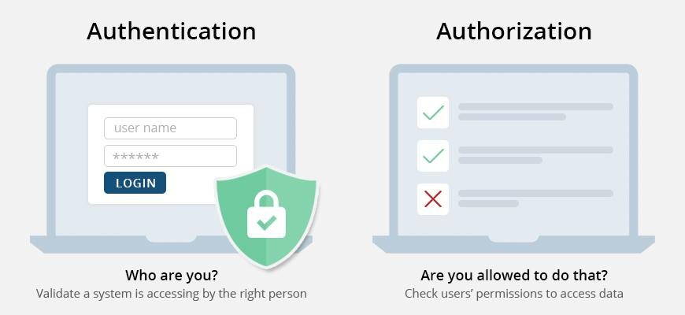

# JWT Tokens

## Cryptography

Cryptography is the science of secret writing with the intention of keeping the data secret. Cryptography is classified into symmetric cryptography and asymmetric cryptography and Hashing..

> Public/Private cryptography..

1. Private key cryptography: In the private key, the same key (secret key) is used for both encryption and decryption. This is symmetric because the only key is copied and shared with other party to decrypt the cypher text. It is faster than public key cryptography..

2. Public key cryptography: In a public key, two keys are used one for encryption and another for decryption. One key (public key) is used for encryption to convert plain text to cypher text and another key (private key) is used by reciever only for decryption to decrypt the cypher text to plain text.

> Stateless vs Statefull

1. Stateless: means we never store states in file's or db's. JWT is based on stateless machanism.
2. Statefull: means we store states in file's or db's.

## What is JWT (JSON Web Token) ?

It is a open, industry standard method for representing claims securely between two parties.

JWT.IO allows you to decode, verify and generate JWT.


JSON Web Tokens consist of three parts separated by dots (.), which are:

1. Header: It determine which type and algorithm of JWT token. There're lots of algorithm's defined we can use any of them.

2. Payload: It determine the information or claims. Claims can be user along with additional data.

   > Claims which are not mandatory but recommended, to provide a set of useful, interoperable claims. Some of them are: iss (issuer), exp (expiration time), sub (subject), aud (audience), and [others](https://datatracker.ietf.org/doc/html/rfc7519#section-4.1).

3. Signature: To create the signature part you have to take the encoded header, the encoded payload, a secret, the algorithm specified in the header, and sign that.


## Authentication vs Authorization

1. Authorization: It is a process to verify what they have access to.
   Example: While login process we verify that we're the actual user to use the resource.
2. Authentication: It is a process to verifying who the user is.
   Example: When we use any resource at throws the error that you don't have permission, it means you're not authorized to use that resource.

#### Example:



## How we can securely store JWT on client side ?

1. Local storage: Most commonly most of the developers store JWT tokens in local storage but there they're not safe. Avoid storing JWTs in localStorage due to the risk of XSS attacks. LocalStorage is accessible via JavaScript, so any script that runs on your page can access it.

2. Session storage: If you need to use client-side storage for JWTs, prefer sessionStorage over localStorage. sessionStorage is scoped to the current browser tab and is cleared when the tab is closed, reducing the exposure window.

3. Cookies: We can store JWTs in cookies and make them sucure by using turing on flags like **httpOnly** and **secure**. This prevents client-side JavaScript from accessing the cookie, reducing the risk of XSS **(Cross-Site Scripting)** attacks.

4. Token Expiry and Renewal: JWTs should have a reasonably short expiration time. Implement token renewal mechanisms using refresh tokens and securely refresh expired tokens without requiring the user to re-enter their credentials.

5. Reduce Token Scope: JWTs should have the minimal necessary payload to reduce the impact of exposure. Avoid storing sensitive information in the JWT payload.

6. Secure against XSS: Mitigate XSS vulnerabilities by properly validating and sanitizing input, encoding output, and using Content Security Policy (CSP) headers to reduce risks associated with malicious scripts.

## What are the common use cases for JWT ?

1. Authorization: JWts are widely used for authorization and access control in web applications.

2. Information exchange: JWTs can be used to securely transmit information betweet parties. The payload of a JWT can contain any data that is relatvent to the application, such as User information, application state or any other data.

3. Stateless authentication: Unlike traditional session-based authentication, JWTs are stateless. This mean that server does not need to keep track of the user's session in a database or any other storage mechanism.

4. Microservices Architecture: In a microservices architecture, JWTs can be used to secure communication between services. Each service can be verify the JWT and extract the encessary information.

5. Token-based API authentication: Many APIs use JWTs as a way to authenticate clients. Clients obtain a JWT after successful authentication and include it in subsequent API requests to prove their identity and access rights.

## How can you invalidate the JWT ?

1. Short Expiration Time: Set a relatively short expiration time for JWTs. This approach limits the lifespan of each JWT, reducing the window of opportunity for misuse if a token is compromised.

2. Token Refresh: Implement a token refresh mechanism where a short-lived JWT (access token) can be renewed using a longer-lived JWT (refresh token). When the access token is expired or needs to be revoked, the refresh token can be used to obtain a new access token.

3. Changing Secret Key: If the JWT is signed using a secret key (symmetric encryption), changing the secret key effectively invalidates all previously issued JWTs because they can no longer be verified by the server.

## Access Token vs Refresh Token

> Access Token

1. Purpose: An access token is primarily used to authenticate a user and grant access to specific resources (e.g., APIs, services) on behalf of the user.

2. Lifespan: Access tokens have a relatively short lifespan, typically ranging from a few minutes to a few hours.

3. Content: Access tokens usually contain information about the user (e.g., user ID, roles, permissions) and are signed by the server to ensure their integrity.

4. Usage: Clients (such as web applications or mobile apps) include the access token in API requests to authenticate themselves and gain access to protected resources.

5. Revocation: Access tokens are stateless, meaning they are not typically revoked once issued. Instead, they expire after a predefined period, and the client must request a new token if the current one expires or becomes invalid.

> Refresh Token

1. Purpose: A refresh token is used to obtain a new access token after the current access token expires or becomes invalid, without requiring the user to re-authenticate.

2. Lifespan: Refresh tokens have a longer lifespan compared to access tokens, ranging from days to months.

3. Security: Refresh tokens are usually stored securely on the client side (e.g., in a secure cookie or local storage), as they can be used to request new access tokens.

4. Usage: When the access token expires, the client sends the refresh token to a dedicated endpoint on the server. If the refresh token is valid and hasn't expired, the server issues a new access token.

5. Revocation: Refresh tokens can be revoked by the server. This allows for more granular control over sessions and access, as servers can invalidate refresh tokens when a user logs out or their account is deactivated.

```
Summary:
Access Token: Used to access protected resources and typically has a short lifespan.

Refresh Token: Used to obtain a new access token when the current one expires or becomes invalid, and has a longer lifespan than access tokens.

In practice, using both access tokens and refresh tokens enhances security by limiting the duration of access tokens and allowing controlled access refresh through the use of refresh tokens.
```

## JWT vs Session

JSON Web Tokens (JWT) and sessions are both mechanisms used for managing authentication and authorization in web applications, but they operate in different ways and have distinct characteristics. Here’s a comparison between JWT and sessions:

> JWT (JSON Web Token):

1. Token Structure: JWT is a compact, URL-safe token format that consists of three parts separated by dots (`.`): header, payload, and signature. It can carry claims (data) about the user.

2. Statelessness: JWTs are typically stateless. Once issued by the server after successful authentication, the JWT is sent to the client and included in subsequent requests (usually in the `Authorization` header). The server does not need to store any session state for the token itself.

3. Scalability: JWTs are advantageous in distributed systems and microservices architectures because they allow each service to independently verify the token without needing to communicate with a central server or database.

4. Expiration and Security: JWTs can have an expiration time set, after which they become invalid. They are cryptographically signed, ensuring that the token has not been tampered with. However, they should be transmitted over HTTPS to prevent interception.

5. Token Contents: JWTs can include user roles, permissions, or other user-related data in the payload, reducing the need to query the database repeatedly for each request.

> Sessions:

1. Server-Side Storage: Sessions involve the server storing session data on the server-side after the user logs in. A session ID is typically sent to the client as a cookie.

2. Stateful: Sessions are inherently stateful because session data is stored server-side. This means the server needs to manage session storage and lookup, which can introduce complexities, especially in distributed systems.

3. Expiration: Sessions can have an expiration time, but the session data itself is stored server-side, so sessions can be invalidated or managed server-side more easily.

4. Usage: Sessions are commonly used in traditional web applications where the server maintains session state for each active user session. This makes them easier to revoke if needed (e.g., for logout functionality).

### Choosing Between JWT and Sessions:

1. Use Cases: JWTs are often preferred in stateless API-based applications and microservices where scalability and performance are crucial. Sessions are more common in traditional server-rendered applications where maintaining session state on the server-side is manageable.

2. Security Considerations: JWTs are generally secure when implemented correctly, but care must be taken with token expiration and proper cryptographic signing. Sessions rely on secure session management and proper cookie handling.

3. Complexity: Implementing JWTs can be initially more complex due to cryptographic operations and token management, whereas sessions may be simpler to implement but require careful management of server-side state.

```
In summary, the choice between JWT and sessions depends on factors such as the architecture of your application, scalability requirements, security considerations, and development complexity. Both have their strengths and are suitable for different types of applications and use cases.
```
